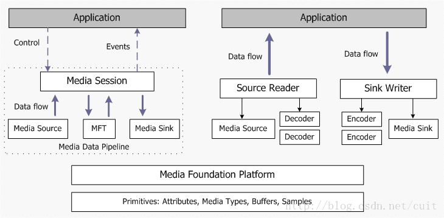

# 不同操作系统多媒体框架  

## 一、Windows多媒体框架  
* Media Foundation  
* DirectShow   

[How to Play Media Files with Media Foundation](https://docs.microsoft.com/zh-cn/windows/win32/medfound/how-to-play-unprotected-media-files) 里面有session  
[Media Foundation——架构](https://blog.csdn.net/sanford81/article/details/4159112)  
[About the Media Session](https://docs.microsoft.com/en-us/windows/win32/medfound/about-the-media-session)  
[Microsoft Media Foundation](https://docs.microsoft.com/zh-cn/windows/win32/medfound/microsoft-media-foundation-sdk)  
[Media Foundation 中支持的媒体格式](https://docs.microsoft.com/zh-cn/windows/win32/medfound/supported-media-formats-in-media-foundation)  
[媒体基础编程指南](https://docs.microsoft.com/zh-cn/windows/win32/medfound/media-foundation-programming-guide)  
[对比Media Foundation 和DirectShow](https://blog.csdn.net/zhaobisha/article/details/2752622)  
[DirectShow和WicrosoftMediaFoundation实现Usb相机，包含H264格式的数据流](https://blog.csdn.net/asla_1/article/details/108751600)  
[Microsoft Media foundation概述（附实例）](https://blog.csdn.net/xinzhiyounizhiyouni/article/details/12712037)  

[应用程序DirectShow简介](https://docs.microsoft.com/zh-cn/windows/win32/directshow/introduction-to-directshow-application-programming)  
[关于 Windows 核心音频 API](https://docs.microsoft.com/zh-cn/windows/win32/coreaudio/about-the-windows-core-audio-apis)  
[使用 DirectShow](https://docs.microsoft.com/zh-cn/windows/win32/directshow/using-directshow)  
[Windows多媒体开发框架介绍](https://blog.csdn.net/jay103/article/details/86665419)  
[C语言WINDOWS API哪个函数可以用来播放本地视频?](https://www.zhihu.com/question/389339030)  
[DirectShow 播放mp4编码 视频](https://blog.csdn.net/wuanshi5/article/details/50392111)  
[Directshow播放mp4视频时出现花屏](https://bbs.csdn.net/topics/390746093)  

[音频和视频](https://docs.microsoft.com/zh-cn/windows/win32/audio-and-video) Windows支持的几种多媒体框架  
[Windows多媒体](https://docs.microsoft.com/zh-cn/windows/win32/multimedia/windows-multimedia-start-page)  
[MCI](https://docs.microsoft.com/zh-cn/windows/win32/multimedia/mci)  

## 二、Linux多媒体框架  
* GStreamer  

[Linux多媒体开发基础](https://blog.csdn.net/lu_embedded/article/details/52448141)  
[Android的多媒体框架OpenCore](https://download.csdn.net/download/sunqn1984kaxika/2639295)  
[GStreamer系列 - 基本介绍 ](https://www.cnblogs.com/xleng/p/10948838.html)  

## 三、安卓多媒体框架  
* Media Framework  

[android多媒体框架介绍（一）整体架构](https://blog.csdn.net/runafterhit/article/details/109020673)  
[Android Media Framework(1): 总纲](https://www.jianshu.com/p/593b14444e79)  

---

## 四、嵌入式多媒体框架  

* 上述各个框架中唯有Windows中的Media Foundation的session框架比较简洁，方便改造成嵌入式多媒体框架，其它的框架都很复杂。  

  
