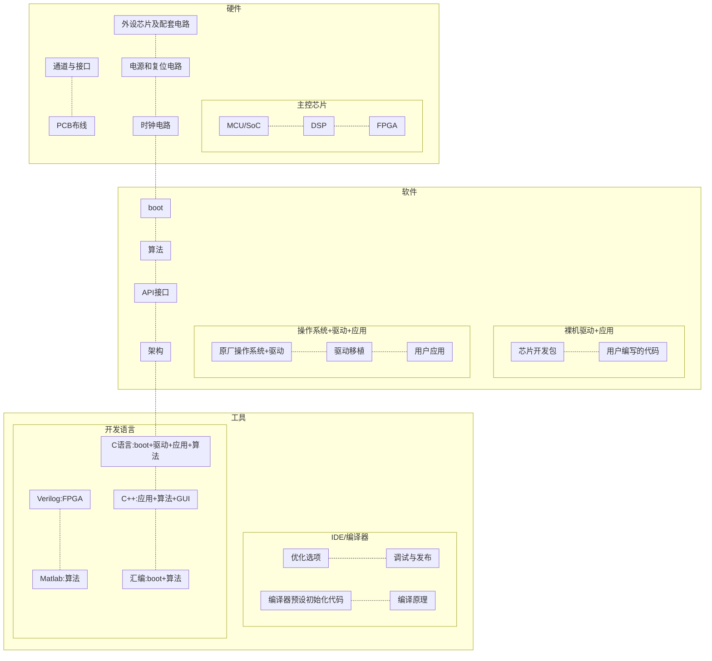
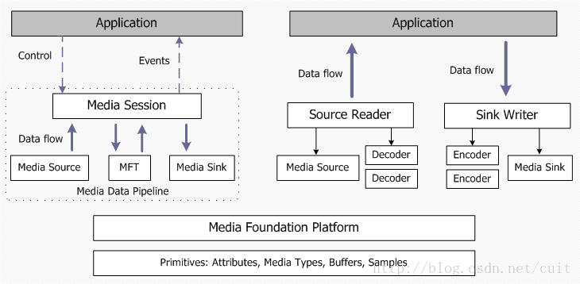

# 嵌入式知识图谱WiKi

---

| 作者   | 将狼才鲸       |
| ---- | ---------- |
| 创建时间 | 2022-02-18 |
|当前更新时间|2022-12-15|

---

*Gitee文档源码仓库地址*： [ 才鲸 / 嵌入式知识图谱WiKi](https://gitee.com/langcai1943/embedded-knowledge-wiki)  
*CSDN文章阅读地址*： [嵌入式知识图谱WiKi](https://blog.csdn.net/qq582880551/article/details/123013592)  
*Bilibili视频讲解网址1*： [嵌入式哪些内容要学哪些不用学](https://www.bilibili.com/video/BV1nG411P7s3)  
*Bilibili视频讲解网址2*： [嵌入式/单片机开发中有哪些通用模块需要掌握](https://www.bilibili.com/video/BV1g14y1N7rE/)  

* 备注：文章内容较多，可从左侧目录跳转着观看。

---

## 一、概述

### 1）模块框图

*备注：因为mermaid subgraph是自动布局，不支持对框图自定义布局，所以这里用 -.- 虚线来控制布局，两个连线之间的元素没有联系。*  

---

<center>图1 嵌入式框图</center>




---

### 2）知识依赖

#### 1. 前提依赖（提前劝退）

+ 1.1 **汉语听说**：学汉字的前提；  

家庭言传身教；  

+ 1.1 **汉字**：阅读理工科类知识；  

*哔哩哔哩拼音启蒙视频网址：* [语文拼音绘本课](https://www.bilibili.com/video/BV1ZJ411m7f5)  
*哔哩哔哩汉字启蒙视频网址：* [学前班幼儿园幼小衔接学习识字3-6岁认字动画入门视频启蒙早教程](https://www.bilibili.com/video/BV1yE411f7hP)  
~~学校对应的课程：语文（小学、初中）~~  

+ 1.2 **行业英语**：编程语言关键字、变量命名、函数命名、写部分英文注释、写部分英文文档、阅读只有英文版的芯片资料、协议资料、算法资料、行业资料、源码注释、源码函数名和变量名；  

*哔哩哔哩英文字母歌视频网址：* [ABC song 经典英文字母歌](https://www.bilibili.com/video/BV1BZ4y1T7i1)  
*哔哩哔哩英语音标视频网址1：* [【48个英文音标的示范读音】音标应该怎么读？](https://www.bilibili.com/video/BV17b411c7A7)  
*哔哩哔哩英语音标视频网址2：* [（纯干货）英语音标教学- YouTube](https://www.bilibili.com/video/BV1Ks41187ev)  
*哔哩哔哩英语单词视频网址1：* [1节课刷完高考英语3500单词（绿色护眼乱序版）](https://www.bilibili.com/video/BV1NK4y147Wo)  
*哔哩哔哩英语单词视频网址2：* [第1季合集：英语单词速记--刷爆英语1000词](https://www.bilibili.com/video/BV1JN411R7wW)  
~~学校对应的课程：英语（初中、高中）~~  

+ 1.3 **数学**：逻辑运算（布尔运算）、算术运算表达式（加减乘除余）、十六进制、二进制、十进制；  

~~学校对应的课程：数学（小学、初中、高中），数字电路（大学）~~  

+ 1.4 **电脑**：键盘布局、拼音或五笔、开机关机、装软件、卸载软件、Linux操作系统高级使用（可选）、计算器使用、写Word/Markdown文档、画Excel表格（可选）、写PPT汇报（可选）、画Visio流程图与框图（可选）、画XMind思维导图（可选）；  

~~学校对应课程：信息技术（小学、初中）~~  

+ 1.5 **计算机（可选，不影响初次入职）**：C语言、单片机、操作系统概念（可选）、中断、线程（可选）；  

大学对应课程：C语言程序设计、单片机原理与应用（可选）、操作系统原理（可选）、模拟电子技术（可选）、数字电子技术（可选）、信号与系统（可选）  

+ 1.6 **视力**（精度可选）：单元测试时要看的LED灯珠（色盲回避）、屏幕显示的UI（可选，色盲色弱回避）；  

+ 1.7 **上肢**：双手健全（键盘打字、快捷键的使用）；  

+ 1.8 **学历与专业**（可选）：看老板态度；  

学校相关专业：  
计算机科学与技术、电子信息科学与技术、微电子学、测控技术与仪器、数学与应用数学、信息与计算科学、信息工程、物理学、 应用物理学、机械设计制造及其自动化、机械工程及自动化、自动化、电子信息工程、通信工程、电子科学与技术、生物医学工程、其它特定行业相关专业如飞行器设计工程、探测制导与控制技术等（本科）  

电子信息工程技术、应用电子技术、微电子技术、嵌入式技术与应用、电子电路设计与工艺、物联网应用技术、物联网工程技术、计算机应用技术、软件技术、智能产品开发、通信技术、机械制造与自动化、数控技术、电机与电器技术、机电一体化技术、工业过程自动化技术、工业自动化仪表、工业机器人技术、汽车电子技术等（专科）  

*备注：计算机相关专业并不占优势（竞争专业过多）*  

*参考网址：* [普通高等学校本科专业目录](http://www.cdgdc.edu.cn/xwyyjsjyxx/xwsytjxx/265591.shtml)  
*参考网址：* [普通高等学校高等职业教育（专科）专业目录（2015年）](https://baike.baidu.com/item/%E6%99%AE%E9%80%9A%E9%AB%98%E7%AD%89%E5%AD%A6%E6%A0%A1%E9%AB%98%E7%AD%89%E8%81%8C%E4%B8%9A%E6%95%99%E8%82%B2%EF%BC%88%E4%B8%93%E7%A7%91%EF%BC%89%E4%B8%93%E4%B8%9A%E7%9B%AE%E5%BD%95%EF%BC%882015%E5%B9%B4%EF%BC%89)  

#### 2. 不同方向的入门（首次入职）

* 注意：涉及到Boot和系统移植的是就职于芯片原厂的驱动工程师岗位
  * 涉及到驱动的，可以是芯片原厂，也可以是终端公司；区别是原厂会写串口/SPI/I2C/USB/网络/音视频/GUI这些通用的驱动和中间件，而终端公司是写与行业相关的驱动，不同的终端公司写的驱动五花八门，什么电源管理芯片、SPI转串口、串口摄像头、智能卡、振镜、激光器、换能器等等。
  * 应用的岗位最多，其次是终端公司的驱动，最后芯片原厂的岗位最少
  * 做应用的分为带GUI界面的应用和无界面的应用
  * 芯片原厂驱动工程师、终端公司驱动工程师、GUI应用工程师、应用工程师所需要的技能树是不一样的，招聘时也不关心你在其它领域有没有经验，而是只关心你在本路线内有没有经验；前期不要全都学，选中一条路线，从这条路线入门即可；也就是说培训机构里教的课程，并不是所有的课对你都有用

2.1 51单片机（软硬件）  
2.2 硬件  
2.3 电源（纹波、低功耗）  
2.4 功放（匹配）  
2.5 STM32等单片机驱动（裸机）  
2.6 STM32等单片机应用（裸机）  
2.7 RTOS移植和驱动（ARM、DSP等）  
2.8 RTOS应用（ARM、DSP等）  
2.9 FPGA（Verilog、数电）  
2.10 Linux移植（U-Boot、根文件系统）  
2.11 Linux字符驱动  
2.12 Linux块驱动  
2.13 Linux应用  
2.14 Qt等GUI图形界面应用  
2.15 通讯算法（调制解调、Matlab、DSP、汇编、C、数学）  
2.16 编解码算法（音视频等）  
2.17 控制类算法  
2.18 人工智能（语音识别、图像识别）

---

#### 3 进阶（高级工程师、管理）

3.1 硬件部门管理  
3.2 软件部门管理  
3.3 51单片机硬件+软件+行业应用+GUI（可选）+架构  
3.4 硬件+电源+功放+量产  
3.5 STM32等单片机驱动+行业应用+架构+通讯协议+GUI（可选）+硬件选型+FPGA（可选）  
3.6 RTOS移植+驱动+行业应用+架构+通讯协议+GUI（可选）+硬件选型+FPGA（可选）  
3.7 Linux移植+字符驱动+块驱动+杂项驱动+通讯协议+硬件选型+FPGA（可选）  
3.8 Linux行业应用+架构+GUI（可选）  
3.9 DSP+调制解调+编解码+人工智能算法   
3.10 不同行业多年经验（与上述岗位相结合）  

| 音视频  | GUI  | 通讯  | 人工智能 | 物联网 | 汽车   | 金融   | 医疗  | 机械   | 激光  | 电力   | 机器人  |
| ---- | ---- | --- | ---- | --- | ---- | ---- | --- | ---- | --- | ---- | ---- |
| 白色家电 | 黑色家电 | 玩具  | 芯片原厂 | 显示  | 航空航天 | 工业设备 | 军工  | 轨道交通 | 光电  | 仪器仪表 | 电机电控 |
| 通信   | 传感器  | 执行器 | 安防   | 自动化 | 生物   |海洋|     |      |     |      |      |

<center>表1 跳槽时（非第一份工作）需要的特定行业经验</center>  
*备注：所以入行需谨慎，第一份工作非常重要，决定你以后很多年的工作走向，除非想转行从零开始*

* 讲解：其中从业人员最多的是嵌入式/单片机应用工程师，他们不用关心中间件和驱动是如何写的，RTOS、Linux是怎样移植的，大部分时间都是写业务相关的应用，或者偶尔在原有的驱动上或者系统配置上稍微修改一下。
  * 少部分是写驱动的，包括裸机驱动、RTOS驱动、Linux驱动，一般都是行业相关外设的驱动，因为一般通用的驱动芯片原厂都已经提供了；有一些复杂通信或者复杂计算的驱动的代码量是非常多的。
  * 至于系统移植、中间件的编写，则都是在芯片原厂了。一些大厂是做通用的芯片，将芯片卖给别人；但还有很多小厂是从芯片到系统、产品、方案都是自己做，所以也需要系统移植、中间件开发、编译器开发、方案开发、应用编写的人员。

* 更多更全的全球芯片公司和产品被应用到的行业介绍见**子文档**[《1.2.3_全球嵌入式芯片公司和所应用行业汇总.md》](./documents/1.2.3_全球嵌入式芯片公司和所应用行业汇总.md)

* 一些具体的嵌入式产品详见 <u>**子文档**</u>：《[4_如何选择练手项目_嵌入式开源项目大全.md](./documents/4_如何选择练手项目_嵌入式开源项目大全.md)》的末尾部分  

*参考网址* [行业研究数据库](https://www.hanghangcha.com/)  
*参考网址* [软件和信息技术服务业行业分类图(嵌入式系统软件行业) ](https://wenku.baidu.com/view/ab9412ad2ec58bd63186bceb19e8b8f67d1cef34.html)  

### 3）写作背景

* 一直想找一个从头到尾介绍嵌入式的网站，就像一般的WiKi网站那样，能够在一个地方就搜到大部分的嵌入式开发知识，但是又没找到，所以我就自己尝试着写，想着有空时陆陆续续加入点内容。
* 因为一些人并不会对嵌入式、单片机从底层到顶层的内容都清楚，有时候如果只想了解一下这个行业的整体全貌的话，那么看看这个文档是个不错的选择。  

#### 1. 嵌入式的定义

+ **嵌入式**：嵌入到各种设备中执行专项任务的计算机软硬件；通常不包含可以执行多种不确定任务（运行各种软件），以计算机原本的功能为主体的设备。  
+ **嵌入式设备**举例：广告机、电视机、机顶盒、洗衣机、冰箱、红绿灯、门禁、扫码、体温枪……  
+ **非嵌入式计算机**举例：笔记本、台式机、服务器、工作站、计算机集群、手机（应用类）。  

#### 2. 嵌入式的核心

+ 嵌入式行业的核心：
  * 嵌入式技术如熟悉芯片通用模块（GPIO、UART、SPI、I2C、USB、网络、WiFi、DMA、蓝牙、2.4G、4G5G、CAN、ZigBee、ModBus），熟悉各类芯片（MCU、DSP、FPGA、51、ARM），熟悉各种操作系统（uC/OS、RT-Thread、FreeRTOS、Linux、eCos、安卓），熟悉通讯协议（OSI七层模型、包头包尾命令码、帧、ACK），熟悉GUI图形界面，熟悉架构（死循环、TASK、多线程、模块统一框架、模块通信队列、模块分层、MVC、主从），这些都不是嵌入式行业的核心技术，只能算是嵌入式软件工程师的立身之本。
  * 嵌入式从名字可以看出，作为控制中枢嵌入到别的设备中，核心技术是和被嵌入的这个设备有关，所以嵌入式行业的核心在于：1、和行业相关的通讯控制指令（如铁塔B接口协议的实现与互联、各国键盘手柄键值映射、GUI指令组态控制实现）；2、和行业相关的控制算法（如激光器振镜移动算法、码流硬件加解扰、通讯调制解调编解码、音质声场噪音处理）；3、质优价廉（BOM成本更便宜、稳定流畅不死机、低功耗够低、工作温度范围宽、OTA升级更方便、加密方式更可靠、人无我有、功能专业）。

+ 嵌入式从业人员的规划：
  * 熟悉编程语言、嵌入式芯片、模块、通讯协议、操作系统、架构，是立身之本，只能让你获得嵌入式平均工资，会遇到嵌入式发展的天花板；但跳槽无忧，天地之大任我行。
  * 选中一个特定行业，深钻此行业的核心技术如架构、通讯、算法，可以突破嵌入式通用天花板，达到行业天花板，缺点是丧失任意更换行业的机动性，就业对象急剧变窄，抵挡大环境变化的能力变弱。有得必有失，风险越大，收益越大。
  * 敏锐的洞察力，遇见了一个未曾出现过的行业、发现了一个传统行业急待嵌入式的解救、发现了一个传统行业一旦被嵌入式加持则会功力大增但无人发觉，那么勇敢的少年，去开拓新的天地吧。不要轻易尝试，一步快才能步步快，但是第一步都已经被人占了。

## 二、各个模块（通用模块）

### 1）硬件设计

* 画好PCB的前提是知道正确的原理图。  
* 选好电源、控制纹波、电源分割，晶振稳定，测试口合理，高频信号稳定，电磁兼容过关，布线长短、差分、等长合适，BOM物料质价合适通用，发热控制，ESD防护，待机电流控制，应力冲击，模块解耦，冗余设计；一致性好，一定要可靠。

[阻抗匹配是什么意思?阻抗匹配原理详解](https://blog.csdn.net/gsjthxy/article/details/91605291)  

#### 1. 硬件架构框图

* 普通硬件设计是围绕着主控芯片及其配套的驱动模块来进行的。  
* 下图是一个典型的硬件框图，包含芯片最小系统、电源模块、各个外设接口。  

<center>图2 硬件框图举例</center>

  

*参考网址：* [基于ARM与μClinux的RTU设计](http://gongkong.gongye360.com/paper_view.html?id=266814)  

#### 2. 硬件设计流程

此处忽略外观设计和结构设计。  
设计流程为：器件选型、原理图设计、PCB设计、输出PCB及BOM表、PCB贴片及验证、软硬件联调。  

*参考网址：* [嵌入式系统硬件组成](https://blog.csdn.net/xiaohongya/article/details/100733863)  
*参考网址：* [一个完备的嵌入式系统硬件架构有哪几部分构成？](https://blog.csdn.net/weibo1230123/article/details/80206223)  
*参考网址：* [嵌入式系统基本概念(硬件篇)](https://blog.csdn.net/qq_36717753/article/details/90582307)  
*参考网址：* [以硬件架构的思维方式看待软件架构（二）](https://zhuanlan.zhihu.com/p/464828478)  

---

### 2）集成电路（IC）设计（扩展内容，可不翻阅）

#### 1. SoC（主控芯片）设计

##### 1.1 SoC架构

* 嵌入式使用的主控芯片（单片机或者MCU）对应于IC设计中的SoC。  

<center>图3 典型的SoC芯片模块图</center>

  

*参考网址：* [SoC架构](https://blog.csdn.net/weixin_39060517/article/details/113619888)  
*参考网址：* [SoC](https://blog.csdn.net/iteye_13202/article/details/82575744)  

架构图解析：  

* SoC（包括MCU、DSP、单片机芯片）的主要框架就是**AHB总线**、**APB总线**和总线上的**模块**（CPU与外设等）。  

* AHB和APB都是ARM公司出品的基于IP开发的SoC系统集成总线，它们一个高速一个低速，其实功能就和USB等总线协议类似，可以接入和控制多个设备（模块），只不过在芯片内用硬件来实现。  

*参考网址：* [AHB百度百科](https://baike.baidu.com/item/AHB)  
*参考网址：* [AHB总线协议](https://blog.csdn.net/ivy_reny/article/details/78144785)  
*参考网址：* [SOC常见架构_RISCV AI SOC实战（一，概述及架构设计）](https://blog.csdn.net/weixin_39693101/article/details/109963793)  
*参考网址：* [SoC知识及选型经验分享](https://blog.csdn.net/lijiuyangzilsc/article/details/46535913)  

| 缩写              | 全名及解释                                                  | 详情                                                         |
| ----------------- | ----------------------------------------------------------- | ------------------------------------------------------------ |
| SoC               | System on Chip，系统级芯片，也称片上系统                    | 一种专用目标的集成电路，将微处理器、模拟IP核、数字IP核（包含各种驱动模块）和存储器(或片外存储控制接口)集成在单一芯片上；具体的产品有：MCU、单片机、DSP、手机等CPU |
| AHB               | Advanced High performance Bus，高级高性能总线               | ARM出品，几乎已经成了行业标准；主要用于芯片内部高性能模块(如CPU、DMA、DSP、ROM、RAM、USB、网络)之间的连接，同样也连接APB低速总线的主控接口Bridge；多主多从设计，有的模块既做主也做从（如DMA） |
| Bridge            | APB桥                                                       | APB总线架构不像AHB支持多个主模块，在APB里面唯一的主模块就是APB 桥 |
| APB               | Advanced Peripheral Bus，高级外围总线                       | 主要用于低带宽的周边外设之间的连接，例如UART、SPI、I2C       |
| CPU               | Central Processing Unit，中央处理器                         | 计算机系统的运算和控制核心，处理指令、执行操作、控制时间、处理数据；数字电路中各种逻辑运算、算数运算、控制的操作接口都是一条指令，指令要转换成特定数字电路模块的入口，所以CPU的工作分为以下5个阶段：取指令、指令译码、执行指令、访存取数和结果写回；主要包括两个部分，即控制器、运算器，其中还包括高速缓冲存储器及实现它们之间联系的数据、控制的总线 |
| DMA               | Direct Memory Access，直接存储器访问                        | 不依赖CPU将一块数据从一个地址空间复制到另一个地址空间，大量节省CPU时间 |
| Flash             | Flash EEPROM，闪存                                          | 是ROM；有两种：NORFlash和NANDFlash；结合了ROM和RAM的长处，不仅具备电子可擦除可编程（EEPROM）的性能，还可以快速读取数据（NVRAM的优势） |
| SRAM              | Static Random-Access Memory，静态随机存取存储器             | 不需要刷新电路即能保存它内部存储的数据，断电后丢失；速度快但贵一点，也用作高速缓存 |
| DDR               | Double Data Rate SDRAM，双倍速率同步动态随机存储器          | 具有双倍数据传输率的SDRAM，其数据传输速度为系统时钟频率的两倍，DDR是一个时钟周期内可传输两次数据，也就是在时钟的上升期和下降期各传输一次数据 |
| SD                | Secure Digital Memory Card                                  | 基于闪存的存储卡，驱动方式为SDIO                             |
| USB               | Universal Serial Bus，通用串行总线                          | 一种高速串行总线，兼容性好速度快                             |
| WDT               | Watchdog Timer，看门狗                                      | 是一个定时器电路，一般有一个输入，叫喂狗，一个输出到MCU的RST端，MCU正常工作的时候，每隔一段时间输出一个信号到喂狗端，给WDT清零，如果超过规定的时间不喂狗，（一般在程序跑飞时），WDT定时超过，就会给出一个复位信号到MCU，使MCU复位，防止MCU死机 |
| Timer             | 定时器                                                      | 定时到了之后给出中断                                         |
| GPIO              | General-purpose input/output，通用型输入输出                | 引脚可以用于输入、输出或其他特殊功能                         |
| UART              | Universal Asynchronous Receiver/Transmitter，异步收发传输器 | 通用串行数据总线，用于异步通信，对应的电气协议有RS-232/RS-422/RS-485，其中485是半双工 |
| I2C               | Inter-Integrated Circuit，内置集成电路总线                  | 一种简单、双向二线制同步串行总线                             |
| SPI               | Serial Peripheral Interface，串行外设接口                   | 一种高速的，全双工，同步的通信总线，使用四根线               |
| System Controller | 系统控制                                                    | 电源、复位、锁相环频率等                                     |
| 其它专用驱动模块  |                                                             | 模块非常多，一个人总是只能精通里面的很少一部分               |

<center>表2 SoC芯片模块英文缩写名词解释</center>

* 除了电源管理、射频处理等少数几个功能外，SOC几乎包办了其它所有硬件功能。  

##### 1.2 CPU（处理器核）

* CPU最重要的特点就是把所有的操作融合成了一种操作方式：指令集。  

<center>图4 典型的CPU内模块框图</center>

  

| 模块      | 子模块                    | 描述                                   |
| ------- | ---------------------- | ------------------------------------ |
| 操作接口    | 指令集、IO接口               | 对CPU的所有操作都通过指令集中的指令和数据来完成            |
| 总线      | 数据总线DBUS、指令总线IBUS、控制总线 | CPU与外界，CPU内指令、数据、译码器、寄存器、算术单元之间的数据通讯 |
| 运算器     | ALU算术单元、FPU浮点单元        | 计算机之所以叫计算机的由来，核心结构是计算                |
| 控制器     | 译码器、JTAG、流水线生成、中断      | 将指令集中的指令转换成实际的操作，和返回操作的结果            |
| Cache缓存 | 指令缓存、数据缓存              | 缓存用于提高速率                             |

<center>表3 CPU内主要模块和子模块</center>

*参考网址：* [深度分析国产龙芯新架构CPU：自主当崛起](https://www.eetop.cn/view-50164.html) 英文框图  
*参考网址：* [微处理器分类及主要技术性能](https://mbb.eet-china.com/blog/3658169-370989.html) 中文原理框图  
*参考网址：* [微处理器微计算机微处理机单片机cpu区别](https://zhidao.baidu.com/question/424009835054682252.html) 有中文框图  
*参考网址：* [计算机组成原理——CPU](https://blog.csdn.net/include_zrl/article/details/112382253) 有中文的简单框图  
*参考网址：* [cpu的结构(CPU的结构与工作原理)](http://www.chenmo.net.cn/998794) 有Cortex-A8的简单框图  
*参考网址：* [cpu架构一](https://blog.csdn.net/sinat_38259539/article/details/84627610) 有中文的CPU结构图  
*参考网址：* [微架构](https://baike.baidu.com/item/%E5%BE%AE%E6%9E%B6%E6%9E%84) 里面的结构图最详细  
*参考网址：* [CPU芯片逻辑设计技术](https://baike.baidu.com/item/CPU%E8%8A%AF%E7%89%87%E9%80%BB%E8%BE%91%E8%AE%BE%E8%AE%A1%E6%8A%80%E6%9C%AF)：CPU设计的基础教程  
*参考网址：* [芯片设计相关基础](https://zhuanlan.zhihu.com/p/431837543)：有奔腾简单的版图与模块框图  
*参考网址：* [芯片设计的起源](https://zhuanlan.zhihu.com/p/104925162)：有一张简单的Intel4004版图与模块框图  

###### **1.2.1 C51核指令集**

* C51（8051）的指令并不多，并且比较简单。  

* 8051单片机共有111条指令（实际256条指令码，如MOV指令分为很多条指令码），按指令功能分，可分为数据传送类29条，算术运算类24条，逻辑运算类24条，位操作类12条，控制转移类22条。  

* 指令寻址方式共7种，分别是：立即数寻址，直接寻址，寄存器寻址，寄存器间接寻址，变址寻址，相对寻址，位寻址。  

* 详细指令内容详见 *参考网址：* [8051汇编指令集](https://blog.csdn.net/u010835747/article/details/119993636)  

*参考网址：* [单片机8051指令集](https://blog.csdn.net/qq_45653763/article/details/107906583)  
*参考网址：* [8051汇编指令](https://www.cnblogs.com/techecho/p/9809662.html)  
*参考网址：* [8051单片机共有多少条指令？](https://zhidao.baidu.com/question/566536288494065644.html)  

* 汇编通过地址跳转即可以实现各种条件判断和循环功能，如if else switch do while for等高级语言的功能。  

* 通过压栈和弹栈的指令即可以各种函数的调用。  

* 有关C51汇编的实际使用和编程技巧，详见**子文档**[《2.3.1.1_c51编程.md》](documents/2.3.1.1_c51编程.md)  

###### **1.2.2 ARM核指令集**

* ARM核各个系列的介绍详见 *参考网址：* [关于ARM的内核架构](https://www.cnblogs.com/zhugeanran/p/8431127.html)  

* ARM 可以用两套指令集：ARM指令集和Thumb指令集。  

*参考网址：* [ARM汇编指令集汇总](https://blog.csdn.net/qq_40531974/article/details/83897559)  
*参考网址：* [ARM指令集](https://blog.csdn.net/weixin_42110547/article/details/86672824)  
*参考网址：* [关于ARM处理器指令集](https://blog.csdn.net/qq_45385706/article/details/108478867)  
*参考网址：* [ARM指令集](https://www.diangon.com/m209371.html)  
*参考网址：* [Arm Architecture Reference Manual for A-profile architecture](https://developer.arm.com/documentation/ddi0487/ha/?lang=en) 文档下载  

* 有关ARM汇编的实际使用和编程技巧，详见**子文档**[《2.3.1.2_ARM编程.md》](documents/2.3.1.2_ARM编程.md)   

###### **1.2.3 DSP指令集**  

* 1.2.3.1 TI DSP
包含C66x、C67x等型号，有各种加速运算的指令。  

*参考网址：* [KeyStone C66x CorePac Instruction Set Architecture](https://training.ti.com/sites/default/files/docs/instruction-set-architecture-presentation.pdf)  
*参考网址：* [MS320C674x DSP CPU and Instruction Set Reference Guide](https://www.ti.com/lit/ug/sprufe8b/sprufe8b.pdf) Chapter 3 Instruction Set  
*参考网址：* [C66x-CorePac用户指南---中文版](https://wenku.baidu.com/view/866eee93de88d0d233d4b14e852458fb770b38dd.html) TI C66x DSP寄存器介绍  
*参考网址：* [TMS3205000系列DSP汇编语言程序设计](https://baike.baidu.com/item/TMS3205000%E7%B3%BB%E5%88%97DSP%E6%B1%87%E7%BC%96%E8%AF%AD%E8%A8%80%E7%A8%8B%E5%BA%8F%E8%AE%BE%E8%AE%A1)  

* 1.2.3.2 Cadence Xtensa HiFi DSP指令集  
详见 <u>**子文档**</u>：《[XtensaHifiDsp.md](https://gitee.com/langcai1943/embedded-knowledge-wiki/blob/develop/documents/2.2.2_1.2.4_XtensaHifiDsp.md)》  

#####  1.3 Xilinx FPGA  

* Vivado开发环境  

*参考网址：* [Welcome to the Xilinx Wiki!](https://xilinx-wiki.atlassian.net/wiki/spaces/A/overview)  

#### 2. 数字IC设计

数字IC设计使用硬件描述语言Verilog，设计时要有时序、并行、延时的思想。  
芯片设计可以分为两部分，前端和后端，仿真也可以分为前仿和后仿。  

*参考网址：* [数字芯片设计入门？](https://www.zhihu.com/question/21892919)  
*参考网址：* [SoC芯片龙头有哪些，SoC芯片概念股一览](http://www.southmoney.com/gupiao/glg/202202/23494806.html)  
*参考网址：* [数字IC设计流程介绍](https://zhuanlan.zhihu.com/p/260933238)  
*参考网址：* [前仿真与后仿真](https://blog.csdn.net/zhangyujie0316/article/details/106360591)  
*参考网址：* [数字IC设计流程及工具简介](https://blog.csdn.net/weixin_39269366/article/details/120665925)  

#### 3. 模拟IC设计

模拟IC设计需要画原理图和版图。  

*参考网址：* [模拟集成电路设计流程（1）——熟悉Cadence环境](https://zhuanlan.zhihu.com/p/344938075)  
*参考网址：* [模拟集成电路设计流程（2）——原理图设计与仿真](https://zhuanlan.zhihu.com/p/344939731)  
*参考网址：* [模拟集成电路设计流程（3）——不同的电路仿真方法](https://zhuanlan.zhihu.com/p/344937484)  
*参考网址：* [模拟集成电路设计流程（4）——版图设计基础](https://zhuanlan.zhihu.com/p/350617982)  
*参考网址：* [模拟集成电路设计流程（5）——版图验证](https://zhuanlan.zhihu.com/p/350813971)  
*参考网址：* [模拟芯片/IC设计，都经历过哪些lesson—learned（经验教训）？](https://www.zhihu.com/question/46956546)  
*参考网址：* [怎样学好模拟集成电路设计？](https://www.zhihu.com/question/25911879)  

---

### 3）软件开发

* 进行一个新项目时，一般会使用芯片原厂提供好的系统或底层库；如果是芯片原厂则会从裸机开始写，会规划好文件夹结构和其中的各个模块，如：  
  arch 独立出来的硬件相关的内容（arch下也有drivers、fs、kernel、lib、mm、usr文件夹，实现这个模块中的硬件相关功能）  
  drivers 设备驱动（里面是抽象的接口，不包含实际硬件寄存器的操作）  
  fs 文件系统（可选）  
  kernel 进程调度（可选）  
  lib 通用中间件、基础模块  
  mm 内存管理（可选）  
  usr 工具类应用  

* 如果使用芯片厂商的开发包，则Boot、驱动、中间件都不用关系，从main函数开始写应用就可以。
* 如果使用操作系统，则可以只管理好应用的文件夹结构，系统启动和驱动以芯片原厂裁剪好的操作系统为准，在此基础上只需要做非常少的填充裁剪就可以正常运行了。

*参考网址：*  
[Linux内核 -- 内核源码结构](https://www.cnblogs.com/y4247464/p/12333955.html)  
[eCos教程2：eCos源码结构分析](http://velep.com/archives/970.html)  
[RT-Thread / rt-thread](https://gitee.com/rtthread/rt-thread)  
[FreeRTOS介绍与源码结构分析](https://zhuanlan.zhihu.com/p/145699420)  
[uCOS-II源码下载及源码目录结构](https://blog.csdn.net/qq_29344757/article/details/77096149)  

#### 1. boot（芯片原厂嵌入式工程师）

**硬件上电流程**  

* 前提：一般嵌入式硬件都有内部IROM、内部IRAM、外部ROM、外部RAM。  

* 在boot前，启动介质中已经烧录或者拷贝了可执行程序。  

* 一般boot分四步：  

1、芯片上电后判断启动介质（启动介质的选择由几个芯片引脚的电平排序来决定，开发时使用跳线，生产则固定启动介质），直接执行ROM启动介质的0地址上的代码，或者将ROM启动介质的0地址及以后的代码拷贝到内部RAM中执行（最开始的启动代码会初始化芯片：如设置CPU频率、关看门狗、关MMU、分配临时内存执行一部分代码、设置异常向量、初始化内存控制器、初始化DDR、分配中断、确定内存资源范围、建立内存空间的映射表、IO端口资源、定义第二步boot入口地址；这部分源码往往由芯片厂商提供的与IDE配套的芯片配置包或者芯片厂商提供的交叉编译器中自带模板；这部分代码是汇编写的）。  

2、与第一步同时，芯片也接收JTAG指令（JTAG执行时不需要ROM中的初始化代码，芯片直接接收并执行JTAG总线上的机器指令序列，这些序列中包含了最开始的芯片初始化机器指令序列），JTAG可以用来加载程序、烧录程序、运行并调试程序。JTAG中的初始化指令序列也由芯片厂商提供的IDE芯片配置包中自带。JTAG需要使用仿真器（如J-Link）。  

3、调用并运行第二阶段初始化代码（第二阶段代码可以从Flash、SD卡、USB、串口、网口等介质中引导）；拷贝第二阶段代码到RAM、初始化堆栈、跳转到RAM运行第二阶段程序，第二阶段程序可以是U-Boot主体，也可以是裸机程序，main函数入口也在第二段初始化代码中，接着会初始化驱动。  

4、如果有操作系统，由U-Boot或者其它的bootloader引导操作系统。  

*参考网址：* [IMX6 uboot的启动流程](https://www.cnblogs.com/cyc2009/p/4077430.html)  
*参考网址：* [TMS320F280025的BOOT流程](https://blog.csdn.net/booksyhay/article/details/120172063)  
*参考网址：* [BOOT流程](https://blog.csdn.net/sp612422/article/details/51730053)  
*参考网址：* [常见SOC启动流程分析](https://blog.csdn.net/weixin_34153893/article/details/93263448)  
*参考网址：* [bootloader(xboot)起动流程分析](http://blog.chinaunix.net/uid-2630593-id-2955923.html)  
*参考网址：* [详解嵌入式系统Boot-Loader](https://blog.csdn.net/liangzc1124/article/details/110180693)  
*参考网址：* [嵌入式u-boot浅析](https://blog.csdn.net/xiaoqiang2080/article/details/77894379)  

* 为什么boot代码要用汇编写：  
  主要是因为C语言的运行环境还没准备好：  
  1、PLL没有启动，CPU工作频率为外部输入晶振频率，非常低；  
  2、CPU工作模式、中断响应函数的入口地址等不确定；  
  3、有些特殊寄存器（处理器状态寄存器、用户模式、堆栈、中断等）只能在汇编中访问；  
  4、初始化CPU缓存，初始化MMU（如果有的话）  
  5、存储空间的各个BANK(包括内存)都没有驱动，内存不能使用；  
  6、堆栈指针需要初始化，设置堆栈；  
  7、初始化.bss全局变量区；  
  8、调用main()函数。  

* 一般初始化的汇编代码默认命名为start.s、crt0.s、STARTUP.A51等。  

* 一般芯片原厂提供的编译器会提供一份默认的boot模板，或者干脆将具体的细节隐藏在了编译器当中，用户在源码工程中看不到。  

*参考网址：* [为什么bootloader起始的代码都是用汇编写的？](https://bbs.csdn.net/topics/370005264)  

##### 1.1 C51 boot

* 分析bin/hex文件

* 可以使用keil自带的模拟器运行程序  

* 使用官方下载的Keil，评估版只支持2K代码空间（C51总共也只支持64K代码空间，但可动态加载进行扩展）  

* 也可以使用SDCC开源编译器，需要自行编写Makefile文件  

C51的详细介绍及boot汇编代码编写详见**子文档**[《2.3.1.1_c51编程.md》](documents/2.3.1.1_c51编程.md)  

简单的C51教程及现成的工程和源码详见**子文档**[《才鲸嵌入式 / 8051_c51_单片机从汇编到C_从Boot到应用实践教程》](https://gitee.com/langcai1943/8051-from-boot-to-application)，开箱即用  

##### 1.2 ARM boot

* 详见**子文档**[《2.3.1.2_ARM编程.md》](documents/2.3.1.2_ARM编程.md)   

#### 2. 系统移植（芯片原厂嵌入式工程师）

<center>图5 操作系统框架</center>

  

* 操作系统包含以下几个主模块：进程管理（线程）、内存管理、文件系统、设备驱动、网络管理（可选）  

| 主模块  | 子模块                                                                           | 描述                    |
| ---- | ----------------------------------------------------------------------------- | --------------------- |
| 进程管理 | TASK、进程或线程创建、挂起、运行、销毁，优先级管理，进程调度，自旋锁，互斥锁，信号量，条件变量，事件，邮箱，管道，Socket套接字，读写锁，共享内存 | PV操作，原子操作，同步与互斥，临界资源  |
| 内存管理 | 物理地址、虚拟地址、内存映射、分页、命中、内存清理                                                     | MMU，实现malloc()、free() |
| 文件系统 | block块，窗口命中，写块，擦除块                                                            | DMA，缓存，volatile关键字    |
| 驱动   | 字符驱动、块驱动、杂项驱动、网络驱动                                                            | 主设备号，子设备号，通用接口，ioctl  |
| 其它   | 中断处理、异常处理                                                                     | ISR和DSR，上半部和下半部，定时器   |

<center>表4 操作系统框架</center>

*参考网址：* [操作系统包含哪些子系统？](https://www.zhihu.com/question/453246529)  
*参考网址：* [Linux 进程与线程的同步与互斥](https://www.cnblogs.com/hzhida/archive/2012/11/01/2750216.html)  

2.1 uCOS（μC/OS）  
2.2 eCos  
2.3 RT-Thread  
2.4 SYS/BIOS（TI）  
2.5 Atomthreads  
2.6 FreeRTOS  
2.7 ThreadX（Cadence Tensilica）  
2.8 VxWorks  
2.9 Linux（U-Boot、kernel、根文件系统）  

**2.10 根文件系统**  

* 如果是Linux可以BusyBox工具来创建根文件系统。  

**2.10.1 Ramfs**  
Ramfs是LinusTorvalds开发的一种基于内存的文件系统，工作于虚拟文件系统(VFS)层，不能格式化，可以创建多个，在创建时可以指定其能使用的内存大小。(实际上，VFS本质上可看成一种内存文件系统，它统一了文件在内核中的表示方式，并对磁盘文件系统进行缓冲。)  

**2.10.2 Ramdisk**  
和网吧一样，用户保存的数据在断电后会丢失，防止入侵和用户乱改乱删文件导致嵌入式设备变板砖。  
Ramdisk是将一部分固定大小的内存当作分区来使用。它并非一个实际的文件系统，而是一种将实际的文件系统装入内存的机制，并且可以作为根文件系统。将一些经常被访问而又不会更改的文件（如只读的根文件系统）通过Ramdisk放在内存中，可以明显地提高系统的性能。  

2.10.3 ext4  
Linux中使用  

2.10.4 FAT32  
兼容U盘、SD卡等经常要在Windows使用的存储设备。  

2.10.5 jffs2  

*参考网址：* [什么是嵌入式的根文件?嵌入式的根文件系统有哪些?](http://www.gec-edu.org/gsnews/show/571664.html)  
*参考网址：*[嵌入式系统中常用的文件系统](https://www.cnblogs.com/wmate/p/13558773.html)  
*参考网址：*[嵌入式 Linux根文件系统移植（三）——根文件系统构建](http://www.360doc.com/content/18/1224/14/8335678_804124205.shtml)  

#### 3. 驱动框架

* 驱动的框架很简单，最基本的结构就是寄存器和中断。寄存器你可以把它理解为一个只能存1个字节到8个字节的内存，里面的数据只要写入了就会一直保存，断电以后会丢失。  
* 驱动的所有的控制都通过上电后向其寄存器写入数据来进行控制，一般寄存器中的一个bit就能控制一项功能。  
* 驱动的数据输入输出也是通过寄存器进行的，与中断配合后向一个寄存器中连续写入数据或者连续读出数据就可以实现通讯数据流的输入输出。  
* 驱动寄存器通用结构：输入输出地址（可与DMA配合）、中断控制  
* 常用的一些驱动都是一些带通讯协议的总线驱动，驱动代码中从只需要实现简单的数据收发功能和到分好几层通讯协议，需要几万行十几万行代码的复杂驱动。  

3.1 裸机驱动架构  

* 不需要考虑多芯片间移植，也没有操作系统的情况下，可以把寄存器的读写、中断处理、与应用交互的API接口都放在同一个文件（对初学者建议这样做，简单；对老手不建议这样做，会给自己的工作带来很多麻烦）。  

* 考虑多芯片间移植，或者使用了操作系统的情况下，驱动需要分层，最简单的是将寄存器操作和中断入口放在一个硬件相关的文件夹中，将逻辑处理和API接口放在另一个驱动文件夹中。  

* 裸机下有架构工程师设计了模块统一接口，或者使用操作系统的情况下，需要对各个模块都使用统一模块类型、模块名称、函数指针作为接口；复杂驱动需要进行分层，硬件相关的作为一层，核心逻辑（core）作为一层，应用调用相关作为一层。这样做的好处是公司产品更新换代使用了更好芯片的情况下，只需要修改硬件相关文件夹（如arch/）中寄存器操作的相关代码。这样不仅仅是减少了代码量，更是减少了bug数量！只要是改过的.c源文件中很容易引入bug，而没动过的.c源码中隐藏的bug就少很多了。

* 裸机下有架构工程师设计了模块统一接口，或者使用操作系统的情况下，涉及消息传递、数据传输的驱动统一使用一个数据通讯接口（如循环缓存、队列等），使用统一的错误码，使用统一的异常处理，使用统一的电源管理（能耗控制）。

4.1 RTOS驱动架构  
4.1.1 uCos  
4.1.2 eCos  
4.1.3 RT-Thread  
……  
4.1.x Linux驱动架构  

#### 4. 驱动模块

* 驱动开发通用的思想是对设备进行抽象，提供人性化、通俗易懂并且简单的操作接口API，比如打开设备、关闭设备、发送数据、接收数据等。  
* 复杂的驱动要进行模块分层。  
* 尽量将一款产品内所有驱动的接口统一，将不同类别的设备都抽象成类似的模块。  
* 预留完善的调试信息与调试接口，方便以后开发时驱动移植与驱动扩展。  
* 对所有可预期的异常情况都要进行判别，不要让上层的调用导致整个系统崩溃。  

##### 4.1 通讯类驱动（芯片原厂嵌入式工程师）

像网络、USB、WiFi、蓝牙，都属于复杂通讯驱动，有自己的通讯协议栈，协议栈分好几层（如物理层、链路层、传输层、应用层），有自己的PHY芯片或者IP，这种驱动的寄存器往往都有几百个，硬件内部就集成了多个状态机，一个人根本不能从零开始写一个完整的驱动。最常用的方式是使用主芯片厂商或者PHY芯片厂商提供的源码进行修改，自己也不用熟悉所有的协议层，只需要清楚自己需要修改的协议知识就可以了。  

调试这类驱动时除了量电气特性的启动握手信号，都需要使用协议分析仪，用示波器根本识别不出实际数据。  

4.1.1 串口  

4.1.2 I2C  
GPIO模拟I2C  

4.1.3 SPI  
GPIO模拟SPI  

###### 4.1.4 网络

* 网络物理层模块有PHY芯片和PHY相关的驱动，链路层有MAC芯片和MAC相关的驱动。一般芯片或者IP厂商都会提供驱动示例的源码。  
* MAC与PHY数据接口有GMII MII RMII，接口规范中定义了MAC和PHY之间引脚的信号定义。  
* 一般MAC集成进芯片内部，PHY在板子上单独有个芯片，如Realtek瑞昱。PHY包含模拟电路，而MAC是数字电路。  
* MAC通过MDIO接口访问PHY寄存器（MDIO上可以接多个PHY）。  
* MII：MAC与PHY之间的数据传输。  

*参考网址：*  
[mac与phy如何实现网络自适应](https://blog.csdn.net/skyflying2012/article/details/47132149)  
[MAC和PHY关系](https://www.cnblogs.com/kdurant/p/4310554.html)  
[以太网交换机如何工作以及MAC和PHY](https://blog.51cto.com/benshitong/1673287)  
[MDIO接口](https://blog.csdn.net/qsczxcedczx/article/details/85782119)  
[MII与RMII接口的区别](https://blog.csdn.net/fun_tion/article/details/70270632)  

* 一款以太网驱动的源码详见**本地文档**：[documents/2.3.4.1.4_网络驱动.md](./documents/2.3.4.1.4_网络驱动.md)

###### 4.1.5 USB

[usb接口DP和DN的电压是多少？](https://www.zhihu.com/question/282414441)  
[USB 接口管脚－D +D 之间电压](https://zhidao.baidu.com/question/307120794.html)  

* USB有PHY芯片（或者芯片内集成PHY IP）和芯片内控制器模块，以及相关的驱动。  
  一般芯片或者IP厂商都会提供驱动示例的源码。  
  一款USB的寄存器及驱动编写介绍**本地文档**：[documents/2.3.4.1.5_USB驱动.md](./documents/2.3.4.1.5_USB驱动.md)

4.1.6 蓝牙  
4.1.7 CAN  
4.1.8 ZigBee  
4.1.9 ModBus  
4.1.10 I2S  

**i2s音频模块**详见 <u>**子文档**</u>：《[i2s模块.md](https://gitee.com/langcai1943/embedded-knowledge-wiki/blob/develop/documents/2.3.4_4.1.10_i2s%E6%A8%A1%E5%9D%97.md)》  

4.2 存储类驱动  
4.2.1 DDR  
4.2.2 Flash  
4.2.3 EEPROM  
……  

4.3 传感器、执行器类驱动  

##### 4.4 行业相关驱动  
4.4.1 键盘  
4.4.2 鼠标  
4.4.3 智能卡  
4.4.4 PCMCIA  
4.4.5 门禁  
4.4.6 水浸  
4.4.7 温度  
4.4.8 破窗  
4.4.9 电能  
4.4.10 计量  
4.4.11 LED  
4.4.12 触摸屏  

###### 4.4.13 显示  

1. 显示功能需要哪些硬件条件：
  * 显示功能一般是驱动液晶屏，液晶屏有RGB接口、MIPI接口、eDP接口、HDMI接口等，芯片需要有该接口的硬件模块。
  * 需要有足够的显存，也就是内存，显存存储不压缩的像素数据，每个像素3个字节，800x600需要800 x 600 x 3 = 1.4M，720p需要1280 x 720 x 3 = 2.6M，1080p需要 1920 x 1080 x 3 = 6M，4k需要3840 x 2160 x 3 = 23.7M；要实现稍微复杂的显示则需要多个图层，假如支持4个图层，就是能在桌面上再打开3个窗口，则各需要5.5M、10.5M、23.7M、95M。由此可见，普通的低端MCU是不能支持通用的显示功能的。
  * 假如需要流畅的切换及显示效果，则需要解放CPU，芯片需要2D或者3D的图形处理模块，或者干脆有GPU核心，如ARM的Mali；需要能在较短的硬件指令周期内实现打点，画线，区域填色、替换、旋转、缩放、移动、透明控制，或者更进一步的3D计算，这些都需要并行处理来加快速度，不管多大的像素面积，需要在较短的指令周期内完成，保证一帧几M几十M的数据在十几ms内处理完成。
  * 想要不直接显示大容量的bmp原始图片的话，则需要有JPEG、PNG图片编解码模块，还有VPU（可以包含在GPU之内）视频编解码模块。
  * 视频编解码模块同样需要有内存支持，一般都需要一帧数据的10倍空间左右；例如1080p本来最少需要 1920 x 1080 x 3 = 6M的显存，那么h264视频的编解码还需要60M左右的内存，hevc的编解码需要的内存还更多一点。
  * 一般需要外接或芯片内置DDR大内存，低端的会使用小容量SRAM内存。
  * 所以综上所述，要有一个通用的显示功能，不是使用便宜的MCU芯片就能实现的。
  * 但是可以外接只实现了2D和图片显示的串口屏，通过串口来控制。
  * 也可以选择只有显示驱动，不使用大显存和2D处理，只使用点阵字库显示文字和普通几何形状的产品，显示不压缩的bmp图片（尺寸很大，有好几M），能实现简单的显示，流畅度没有自带2D加速或者GPU的好；这类芯片往往也是运行Linux系统，使用FrameBuffer写显存，一个FrameBuffer需要无压缩的存放所有像素的数据，需要好几M，一般由于内存限制也不能做多图层；这类芯片常用的有NXP（飞思卡尔）的i.MX系列。
  * 一般含有GPU的MCU会搭载Linux或者安卓系统。
  * 嵌入式行业使用的，包含GPU的芯片有：全志、瑞芯微、海思、NXP等，这和低端嵌入式产品被ST、TI、NXP等国外厂商占据大部分份额不同，国内芯片厂商很受欢迎。

4.4.14 MIPI  

MIPI是一个接口集，里面常用的是DSI显示接口和CSI摄像头接口。  
MIPI屏的接口不固定，pin数量也不固定，常用的有40pin、26pin。  
MIPI屏的一个很大的特点是屏幕小但是像素高，多见于竖屏，常用的分辨率有720x1280、1080x1920。  

[MIPI介绍(CSI DSI接口)](http://www.cnector.net/pdshowtwo/newsshow_5233756.html)  
[MIPI自学笔记](https://zhuanlan.zhihu.com/p/92682047)  
[MIPI_DSI协议简要介绍](https://blog.csdn.net/caihaitao2000/article/details/80224976)  

4.4.15 PWM  
4.4.16 i2s音频  
4.4.17 ADC/DAC音频  
4.4.18 激光振镜  
4.4.19 激光器  
4.4.20 换能器（水声） 
4.4.21 电机   

4.5 杂项驱动  

#### 5. 软件架构（应用框架）

##### 5.1 缓存结构

* 1、各种缓存结构：  

基础：指针、链表、内存、数组。  
数据结构基础：表、树、图（多对多）。  
缓冲区/buffer/顺序表/平直缓存/数组/内存指针（malloc）。  
栈/stack：因为是先进后出，也用于函数调用时的压栈，编译器和高级算法中用的多，日常编程基本上不用。  
堆/heap/完全二叉树：方便排序，编译器和算法中常用，日常编程基本上不用。  
环形缓冲区/环形缓存区/循环队列/loop_buffer/ring_buffer/队列/FIFO/Queue：先进先出，满和空。  

*参考网址：*  [什么是队列（队列存储结构）](http://c.biancheng.net/view/3352.html)  
*参考网址：* [链式队列及基本操作（C语言实现）](http://c.biancheng.net/view/3354.html)  
*参考网址：*  [数据结构与算法教程，数据结构C语言版教程！](http://c.biancheng.net/data_structure/)  

分组队列/多级队列/group_buffer/fifo/queue：每个模块都有自己的队列，且不同队列间可直接通过数据指针无消耗转移大块数据。  

* 2、自行实现的 **“多级缓存队列”模块** Gitee仓库源码：[点击此处查看源码](https://gitee.com/langcai1943/embedded-knowledge-wiki/tree/develop/source/lib/group_buf_queue)  
  本地路径：嵌入式知识图谱WiKi\source\lib\group_buf_queue\   

有gcc-makefile和Qt两个工程都能编过，带详细注释和单元测试用例。  

**目录结构：**  

```
jim@DESKTOP-SVP3BEM MINGW64 /d/3_doc/嵌入式知识图谱WiKi/source/lib/group_buf_queue (develop)
$ tree
.
|-- Makefile
|-- arch_buffer_config.c
|-- arch_buffer_config.h
|-- group_buf_queue.c
|-- group_buf_queue.h
|-- group_buf_queue_init.c
|-- group_buf_queue_init.h
|-- group_buf_queue_unitest.c
|-- group_buf_queue_unitest_qt_proj
|   `-- group_buf_queue_unitest_qt_proj.pro
|-- list.h
|-- module_buf_queue.c
|-- pair_list.c
|-- pair_list.h
`-- readme.txt

1 directory, 15 files
```

**单元测试结果：**  

```
jim@DESKTOP-SVP3BEM MINGW64 /d/3_doc/嵌入式知识图谱WiKi/source/lib/group_buf_queue (develop)
$ ./group_buf_queue_demo.exe
         buffer_unitest start          
got buf: [group_flag: 1] [addr: 0x0040d760] [buf_maxsize: 512] [len: 0]
push data: :) my first buffer message ^_^
got buf data: [group_flag: 1] [msg: :) my first buffer message ^_^] [len: 31]
________ buffer_unitest test pass. ________

          pair_list_unitest start          
put data: :) my first buffer message ^_^
got data: :) my first buffer message ^_^
________ pair_list_unitest test pass. ________

         circular_linked_list_unitest start         
put a node
node count: 1
put a tail node
node count: 2
delete a node
node count: 1
________ circular_linked_list_unitest test pass. ________

group_buf_queue_unitest.c test pass.
```

##### 5.2 模块统一接口

* 备注：用Visual Studio和Qt + MSVC编译偏底层的C程序会报错（如使用了typeof等GNU C特性时），推荐使用Qt + MinGW 64-bit 或者 gcc编译。  

* 备注：Windows下也可以安装gcc和make（安装此软件时同时也会后台安装MinGW环境），然后可以直接在Windows命令行cmd中执行make生成exe。  

* 备注：Qt + MinGW创建工程时不能使用Paint C++，只能使用Paint C，因为编译时会报一些C++专有的关键字错误（如new关键字），和部分类型强制转换不支持等错误。  

* 1、自行实现的 **“通用模块”** Gitee仓库源码：[点击此处查看源码](https://gitee.com/langcai1943/embedded-knowledge-wiki/tree/develop/source/lib/module_core)  
  本地路径：嵌入式知识图谱WiKi\source\lib\module_core\ 支持make编译和Qt编译，带详细注释和单元测试用例。  

* 2、目录结构  

```
jim@DESKTOP-SVP3BEM MINGW64 /d/3_doc/嵌入式知识图谱WiKi/source/lib/module_core (develop)
$ tree
.
|-- Makefile
|-- module.c
|-- module.h
|-- module1.c
|-- module2.c
|-- module3.c
|-- module_queue.c
|-- module_queue.h
|-- module_unitest.c
`-- module_unitest_qt_proj
    `-- module_unitest_qt_proj.pro

1 directory, 10 files
```

**单元测试结果：**  

```
jim@DESKTOP-SVP3BEM MINGW64 /d/3_doc/嵌入式知识图谱WiKi/source/lib/module_core (develop)
$ ./module_core_demo.exe
         module_unitest start         
 'module1 >>>1<<<' module_create
 'module2 )))2(((' module_create
 'module3 \\\3///' module_create
 'module1 >>>1<<<' module_start
 'module2 )))2(((' module_start
 'module3 \\\3///' module_start
 'module1 >>>1<<<' module_process
 'module2 )))2(((' module_process
 'module3 \\\3///' module_process

module1 >>>1<<< put data:  '@_@ @o@ from module1 1 1'  >>>>>>>>
 'module1 >>>1<<<' module_process
 'module2 )))2(((' module_process
 'module3 \\\3///' module_process
module2 )))2((( got data:  '@_@ @o@ from module1 1 1'  <<<<<<<<


module2 )))2((( put data:  ':) :-) from module2 2 2'  >>>>>>>>

module1 >>>1<<< put data:  '@_@ @o@ from module1 1 1'  >>>>>>>>
 'module1 >>>1<<<' module_process
 'module2 )))2(((' module_process
 'module3 \\\3///' module_process
module3 \\\3/// got data:  ':) :-) from module2 2 2'  <<<<<<<<

module2 )))2((( got data:  '@_@ @o@ from module1 1 1'  <<<<<<<<


module2 )))2((( put data:  ':) :-) from module2 2 2'  >>>>>>>>

module1 >>>1<<< put data:  '@_@ @o@ from module1 1 1'  >>>>>>>>
 'module1 >>>1<<<' module_stop
 'module2 )))2(((' module_stop
 'module3 \\\3///' module_stop
 'module1 >>>1<<<' module_distroy
 'module2 )))2(((' module_distroy
 'module3 \\\3///' module_distroy
________ module_unitest test pass. ________

module_unitest.c test pass.
```

##### 5.3 状态机

* 状态机用于多任务、多线程、循环中反复执行的函数中进行状态切换。  
* 状态机的实现与应用的源码详见章节 5.2 模块统一接口。  

##### 5.4 循环、TASK、定时器

* “循环”实现与应用的源码详见章节 5.2 模块统一接口。  
* TASK。  
* 定时器：可以用来实现TASK或者一次性延时任务，也可以用来实现精确的系统时间。  

##### 5.5 多线程、同步与竞争

##### 5.6 通信协议

* 源码本地路径：嵌入式知识图谱WiKi\source\lib\communicating_protocol  

* 概念：总线、局域网（以太网）、TCP、UDP、IP、私有协议  

* 总线：  
  总线是一组信号线和通信协议的集合，包含信号电气与机械特性，用于多组件间的数据传输。一些概念有传输速率、仲裁、并行串行、同步异步、差分、主从、一对多、多对多、时分复用。  
  总线是一个拓扑概念，相关的拓扑概念有：星形、总线型、环形、树形。  

* 私有协议的通用概念：包头、包长、命令码、数据、累加和、包尾，ACK，重传，可靠传输，单次传输、批量传输、状态机。  

* 如果是单芯片内基于内存拷贝、缓存队列、或者函数调用的模块间通信，信道可靠、不需要ACK响应，可以不使用主从模式，发送模块随时发送数据，接收模块实时接收数据或者模块轮询时查询数据。

* 通信协议概述详见**子文档**[《2.3.5.6_通信协议.md》](documents/2.3.5.6_通信协议.md)  

* 实现私有自定义通信协议的示例：详见**子文档**[《2.3.5.6_私有通信协议.md》](documents/2.3.5.6_私有通信协议.md)，该协议采用主从模式，单对单通信，没有路由模块和路由表。  

#### 6. 汇编应用

##### 6.1 汇编应用框架

* 多用标号和压栈弹栈。  

#### 7. 行业相关应用

##### 7.1 GUI框架

###### 7.1.1 Qt编程

**Qt编程**详见 <u>**子文档**</u>：《[从零开始学习Qt GUI编程](https://gitee.com/langcai1943/qt_gui_simple2complex)》 内容非常全，含各种源码  

* C++与C语言混合编程，C++工程中调用纯C gcc编译的库的方法见Qt主仓库中的qt_gui_simple2complex\source\005_Qt_with_C_language章节，链接如下：  
  [ qt_gui_simple2complex/ source / 005_Qt_with_C_language](https://gitee.com/langcai1943/qt_gui_simple2complex/tree/develop/source/005_Qt_with_C_language)  

###### 7.1.2 uC/GUI

##### 7.2 多媒体框架

###### 7.2.1 Linux、Windows、安卓多媒体框架

详见 <u>**子文档**</u>：《[2.3_7.2.3_不同操作系统多媒体框架.md](./documents/2.3_7.2.1_不同操作系统多媒体框架.md)》  

###### 7.2.2 嵌入式多媒体（音视频API）

* 上述各个框架中唯有Windows中的Media Foundation的session框架比较简洁，方便改造成嵌入式多媒体框架，其它的框架都很复杂。  

  

- **音视频**是指：  
  a) 音频播放和录制：mp3、aac、ac3、wav（未编码的裸流）、pcm（未编码的裸流）  
  b) 音视频播放和录制：mp4、mkv、flv、ts（音视频封装），h264、h265(hevc)、vp8、vp9（纯视频流）
  c) 图片显示和抓取：jpeg(jpg)、mjpeg、png、jif  

- **音视频基础知识**完整内容详见*子文档*：《[音视频开发](https://gitee.com/langcai1943/audio_video_codec)》 内容全  

音视频编解码的参考源码有ffmpeg。  

- **FFmpeg音视频编解码**完整内容详见 <u>**子文档**</u>：《[ffmpeg源码及架构分析](https://gitee.com/langcai1943/audio_video_codec/blob/develop/2_ffmpeg%E6%9E%B6%E6%9E%84.md)》内容全  

- **Linux下音视频播放程序源码（用于嵌入式播放器的仿真）**  
  详见 <u>**子工程仓库**</u>：《[才鲸 / 嵌入式播放器](https://gitee.com/langcai1943/embedded-player)》  

- **Windows下音视频播放器源码（用于嵌入式播放器的仿真）**  
  详见 <u>**子工程仓库**</u>：《[ 才鲸 / Qt GUI从简单到复杂 embeded_player](https://gitee.com/langcai1943/qt_gui_simple2complex/tree/develop/source/005_Embeded_player/)》  

###### 7.2.3 Qt多媒体（音视频，含界面）

* **Qt多媒体**详见 <u>**子文档**</u>：《[MultiMedia_VideoAudio.md](https://gitee.com/langcai1943/qt_gui_simple2complex/blob/develop/source/003_MultiMedia_VideoAudio/documents/MultiMedia_VideoAudio.md)》 内容全  

* [Qt官方播放器源码（纯应用）](https://gitee.com/langcai1943/qt_gui_simple2complex/blob/develop/source/003_MultiMedia_VideoAudio/003_qt6.2.3_multimedia/documents/003_qt6.2.3_multimedia.md)  

7.3 传感器采集与校准  
7.4 电视节目加解扰  
7.5 键盘键值（不同国家布局、不同游戏手柄布局）  
7.6 蓝牙音响  

#### 8. 通用算法

调制解调  
编解码  
人工智能  

#### 9. 行业相关算法

8.1 水声  
8.2 激光打标（显示类）  
8.3 通讯  

## 三、工具使用

### 1）编码语言

#### 1. C语言

* 编码规范，命名规范， 注释规范  
* C语言的全部介绍详见另一个仓库中的文档《[ C语言框架讲解](https://gitee.com/langcai1943/embedded_programming_skills/blob/develop/0_doc/02-C%E8%AF%AD%E8%A8%80%E6%A1%86%E6%9E%B6%E8%AE%B2%E8%A7%A3.md)》

#### 2. 51汇编

* 指令集信息详见2-2-1_1-2-1章节“51核指令集”。  

* 文件命名：可以以.ASM或.asm做为文件后缀，存放源程序，以.INC或.inc作为文件后缀，存放头文件。  

* 注释：以; 分号开头的行都是注释，多用注释描述清楚函数、函数的参数和函数块的功能，因为汇编很难看懂，尽量让别人光看你的注释就能知道你的逻辑。  

"宏定义"：DATA、BIT、EQU伪指令，编写程序前将各种寄存器地址、要用到的常量值，都用“宏定义”定义一遍，既让程序清晰又方便查找。使用举例：  

```asm
    TCON    DATA    88H        ; 宏定义IRAM地址
    IT0        BIT        TCON.0    ; 宏定义位
    AD        EQU        0F1H    ; 宏定义立即数或地址
```

[51汇编中DATA和EQU](https://blog.csdn.net/qq_38352677/article/details/83477993)  

* "函数名"：标号。以: 冒号结尾的就是标号，可以跳转到此处开始执行程序。实现for() switch() while() 等循环结构时用标号，实现函数的调用时也用标号。使用举例：  

```asm
RESET:        ; 每次复位时就跳转到这里执行
    CLR RS0
```

[51单片机汇编语言的标号是如何定义的](https://zhidao.baidu.com/question/156850472.html)  

* 宏定义函数：用MACRO 和 ENDM包围即可。使用举例：  

```asm
MY_MACRO_FUNC MACRO AA BB CC ; 定义MY_MACRO_FUNC宏定义函数，它有三个参数
    MOV AA_ADDR, # AA         ; #表示一个立即数，没有=等号，用mov进行赋值
    MOV BB_ADDR, # BB
    MOV CC_ADDR, # CC
ENDM
```

[汇编语言中macro的用法](https://www.cnblogs.com/onesea/p/15745506.html)  
[51 汇编 指令 单片机 @ 和 # 区别](https://zhidao.baidu.com/question/585135031.html)

* 函数使用标号作为入口，返回时要调用RET指令，函数被别人调用时使用LCALL指令。  
* 需要使用一个局部变量时，多用A寄存器（ACC），只是要压栈和弹栈。使用举例：  

```asm
app_sync:         ; 一个函数入口
    PUSH ACC     ; 压栈，可以给A赋值多次，再压栈多次，退出函数时再弹出多次把值还给赋值的
    NOP            ; 空语句
    MOV A, APP_DATA    ; 使用A作为临时变量
    ANL A, #40H    ; 对临时变量进行操作
    NOP
    POP ACC        ; 弹栈
    RET            ; 函数返回
    NOP

my_func:
    LCALL app_sync    ; 调用函数
```

* 汇编中中断程序是固定地址。中断示例：  

```asm
    ORG     0000H ; 定位的伪指令
    LJMP    RESET ; 跳转到函数

    ORG        000BH
    LJMP    T0INT

    ORG        001BH
    LJMP    T1INT
```

[51单片机汇编中断程序（导引）](http://www.51hei.com/bbs/dpj-30671-1.html)  

* 参数传递：  
  [32bit 汇编函数调用参数传递是通过堆栈来实现的](https://www.cnblogs.com/bugman/archive/2011/10/07/2200688.html)  
  [C51函数参数传递和返回](https://www.51dzw.com/embed/embed_109991.html)  

* 51单片机汇编更详细的介绍及boot汇编代码编写详见**子文档**[《2.3.1.1_c51编程.md》](documents/2.3.1.1_c51编程.md)  
* 更多C51汇编教程及现成的工程和源码详见**子文档**[《才鲸嵌入式 / 8051_c51_单片机从汇编到C_从Boot到应用实践教程》](https://gitee.com/langcai1943/8051-from-boot-to-application)，开箱即用  

#### 3. ARM汇编

* 详见**子文档**[《2.3.1.2_ARM编程.md》](documents/2.3.1.2_ARM编程.md)   

#### 4. TI DSP汇编

#### 5. Cadence Xtensa汇编（HiFi DSP）

#### 6. Verilog硬件描述语言

#### 7. Matlab语言

#### 8.Makefile语法（扩展内容）

#### 9.正则表达式（扩展内容）

#### 10.SQL数据库（扩展内容）

#### 11. Git语法

#### 12. Markdown语法（扩展内容）

详见 <u>**子文档**</u>：《[Markdown语法](https://gitee.com/langcai1943/embedded-knowledge-wiki/blob/develop/documents/3.1.13_Markdown%E8%AF%AD%E6%B3%95.md)》  

#### 14. IDE编译环境

* Keil、GCC+Makefile、Qt、Eclipse、Vivado、Altium等IDE集成开发环境
* C语言标准库、厂商BSP开发包、芯片厂商编译器、芯片厂商算法库

### 2）通讯协议

[接口协议（四）：以太网（Ethernet）学习（一）：协议](https://blog.csdn.net/qq_40483920/article/details/108262953)  

#### 1. OSI七层协议

#### 2. 网络

#### 3. USB

……  

## 三、理论知识

### 1）操作系统原理（扩展内容）

### 2）编译原理（扩展内容）

### 3）信息论（扩展内容）

### 4）离散数学

1. 快速傅里叶变换  

### 5）自动控制

### 6）数据结构

### 7）开发方法

瀑布开发 敏捷开发  

### 8）测试方法

单元测试 集成测试 老化测试 白盒测试 黑盒测试  

## 四、项目实践

* 一些开源的嵌入式项目详见 <u>**子文档**</u>：《[4_如何选择练手项目_嵌入式开源项目大全.md](./documents/4_如何选择练手项目_嵌入式开源项目大全.md)》  

### 4.1 自运行的吃豆人程序

详见 <u>**子文档**</u>：《[才鲸 / C语言小游戏](https://gitee.com/langcai1943/c-little-game)》  

### 4.2 Linux下视频播放嵌入式仿真程序

详见 <u>**子文档**</u>：《[才鲸 / 嵌入式播放器](https://gitee.com/langcai1943/embedded-player)》  

### 4.3 Qt安卓手机群控PC软件

详见 <u>**子文档**</u>：《[才鲸 / qtscrcpy_tc_安卓手机群控](https://gitee.com/langcai1943/qtscrcpy_tc)》  

### 4.4 Qt下视频录制嵌入式仿真程序

详见 <u>**子文档**</u>：《[Qt实现音视频播放器、多媒体开发框架（用于嵌入式播放器在PC上的仿真和多媒体框架学习）](https://gitee.com/langcai1943/qt_gui_simple2complex/tree/develop/source/007_Embeded_Player)》  

### 4.5 底层硬件平台开发

* 选型一款芯片，不使用芯片厂商提供的开发包和操作系统，自己实现底层接口，供应用使用。  
* 包括IDE配置、可执行文件分析、boot编写、驱动编写、中间件编写。  

### 4.6 面向用户应用开发

* 选型一款芯片，尽可能使用芯片厂商提供的底层开发包，自己只着重于应用实现。  

## 五、其它

待完善……  

### 5.1 嵌入式编程技巧

详见 <u>**子文档**</u>：《[才鲸 / 嵌入式编程技巧](https://gitee.com/langcai1943/embedded_programming_skills)》  

### 5.2 嵌入式软件笔试题汇总

详见 <u>**子文档**</u>：《[才鲸 / 嵌入式软件笔试题汇总](https://gitee.com/langcai1943/embedded_exercise_problems)》  

### 5.3 QEMU仿真器（模拟器）

* 如果你也像我一样，虽然大学学的是电子和硬件，也做过boot、系统移植、驱动这些底层代码，但是并不喜欢随身带个板子，也没买过开发板；验证代码功能时为了节省调试时间，喜欢先用gcc写个纯逻辑的代码工程在PC上先测试一遍，只有真正调试时才上交叉编译工具或者Keil直接用硬件仿真器下到板子里运行。那么此时QEMU硬件模拟器是一个不错的选择，很多开发板都有QEMU版本的模拟器，可以直接把开发板的二进制执行文件通过QEMU来运行，有常用的外设和LCD液晶屏模块，普通功能可以直接运行，但是并不能仿真所有硬件驱动，特别是一些特殊的不通用的驱动。  

* QEMU仿真嵌入式开发板的简述详见 <u>**子文档**</u>：《[QEMU默认支持的所有开发板列表](https://gitee.com/langcai1943/embedded-knowledge-wiki/blob/develop/documents/%E5%85%B6%E5%AE%83/QEMU%E9%BB%98%E8%AE%A4%E6%94%AF%E6%8C%81%E7%9A%84%E6%89%80%E6%9C%89%E5%BC%80%E5%8F%91%E6%9D%BF%E5%88%97%E8%A1%A8.md)》  

* QEMU仿真器的源码分析和使用教程详见 <u>**子文档**</u>：[《5.3_QEMU仿真器-模拟器详解.md》](documents/5.3_QEMU仿真器-模拟器详解.md)  

* QEMU实战项目，能够开箱即用的工程，包含有QEMU执行的各种板子的可执行文件，参见我的另一个仓库：[才鲸嵌入式 / 嵌入式QEMU教程](https://gitee.com/langcai1943/cj-security-camera)

### 5.4 嵌入式找远程岗位、兼职、和接私单的方法

详见 <u>**子文档**</u>：《[才鲸 / 嵌入式远程岗位_兼职_私单](https://gitee.com/langcai1943/embedded_remote_work)》  

### 5.5 理工科考证获取额外收入

详见 <u>**子文档**</u>：《[才鲸 / 专利代理师（仅限理工科）](https://gitee.com/langcai1943/ZhuanDai)》 注：专代很快就要取消，不能考了  

游戏、UI、web前端、web后端、数据库、安卓、iOS、安全、大数据、人工智能、云计算、高级语言：Java，Python，C#、工具类：Json、正则表达式、网络协议栈、XAML、MinGW、MSYS2、Cygwin、Wine兼容层……  

### 5.6 写Linux应用程序
* 如果要写带窗口的程序，可以使用X11，但是还是建议使用Qt，因为Linux下的窗口程序的用武之地很少；
  * 如果是命令行程序，使用Linux比使用Windows更好，技能更通用；

### 5.7 写Windows应用程序（功能仿真和模拟用）
* 有些嵌入式的功能，如果是能抽象的，和硬件剥离的，虽然开发时能直接在板子上调试，但每次下代码都比较麻烦，或者每次编译程序都要很久；如果能直接在Linux或者Windows上直接写Demo运行，是能提高工作效率的。
  * 如果是通用的C程序，可以使用MinGW下的gcc编译器，采用C语言标准库和Linux的API；
  * 如果是GUI程序和带显示窗口的程序，可以使用Windows API，也可以使用Qt；
  * 如果是本来就在芯片原厂开发GUI库，或者GUI功能很简单，或者要实现一些复杂的动画，那么使用Windows API是个很好的选择；
    * win32 API能实现一些常用的功能：文件系统、外设、进程、线程、注册表、错误处理、2D显示(各种画图)、图形控件（按钮、滚动条、鼠标、键盘）、对话框、控件（状态栏、进度条、工具栏、标签）、Windows shell 命令、网络socket；

* *参考网址：*
  * [Windows API](https://baike.sogou.com/v3354197.htm?fromTitle=Windows+API)
  * [Windows API 入门](https://blog.csdn.net/x_y_q_/article/details/52352523)
  * [各种常用的 Win32Api 汇总](https://blog.csdn.net/weixin_42100963/article/details/107242265)

## 六、专用模块

### 1）字库
* 字库有点阵字库和矢量字库，有些嵌入式里面是使用的是点阵字库，而点阵字库一般是用工具从矢量字库中转出来的。
* 常用的字库有TTF字库。
* 一个矢量字库的后缀往往是.ttf，大小有十几M。
* 依靠编码方式，如GB2312、UTF-8等；矢量字库的每个字模都需要4字节地址偏移和2字节字模长度（举例）来指示在字库中的位置。
* 支持矢量字库的板子，往往需要用软件解析字库的.ttf文件，硬件上只负责选择一个个具体的字模，所以也需要熟悉.ttf文件的存放格式。
* .ttf字体文件中存储的是TrueType字体。另一种字体是OpenType。
* TrueType字体大端编码，和Windows、Linux编译器都不一样。
* 只使用.ttf关键字，而不加上sfnt的话，在中文环境中搜不到详细的描述，只有英文版中能搜到有用的信息。
* .ttf文件存放的首先是描述自己有多上张表，然后是字体目录，接着具体每个字的字模可以任意顺序存储；.ttf文件由多个表组成，每个表都会字节对齐，不对齐的部分进行补0；
* .ttf中每个表都有一个名字（和mp4中box名字类似）；常用的表有cmap：一个字从索引到存储的映射；glyf：单个字的所有轮廓；head：整套字体的名称；
* .ttf字体存放的组织格式称为sfnt，类比的话，如果.ttf是指视频文件，sfnt就是mp4容器格式。
* .ttf字体文件中首先描述有多少张表，然后第一个表是映射表cmap，里面可能包含多个子表，不同的编码方案有一张表。
* 具体每个表的详细描述，可以使用ttf + 4个字母的表名进行搜索，也可以在下面链接中的苹果官网中查看。

* *参考网址：*
* [点阵字库与矢量字库](https://blog.csdn.net/qq_28258885/article/details/115166245)
* [【每日AI】什么是矢量字库？](https://blog.csdn.net/TUSTer_/article/details/122655730)
* [ttf文件结构解析](https://blog.csdn.net/a369488983/article/details/101586668)
* [字体文件格式详解](https://blog.51cto.com/zhangchiworkos/5158114)
* [TrueType Reference Manual苹果官方英文文档](https://developer.apple.com/fonts/TrueType-Reference-Manual/)
* [TTF字体表](https://developer.apple.com/fonts/TrueType-Reference-Manual/RM06/Chap6.html)
* [“cmap”表](https://developer.apple.com/fonts/TrueType-Reference-Manual/RM06/Chap6cmap.html)
* [字体格式解析笔记整理一:SFNT包装格式](https://www.jianshu.com/p/21ae2dc5c50a)


---


