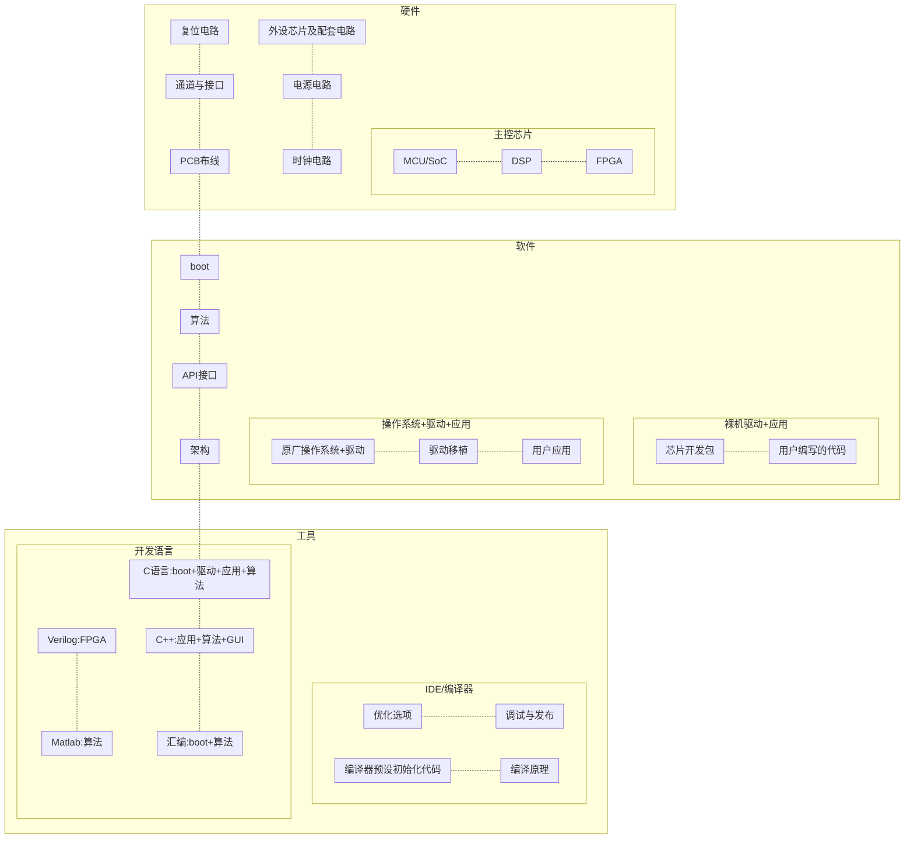

# 嵌入式知识图谱WiKi  

---

|作者|将狼才鲸|
|---|---|
|时间|2022-02-18|

---

*Gitee文档源文件仓库网址* [ 才鲸 / 嵌入式知识图谱WiKi](https://gitee.com/langcai1943/embedded-knowledge-wiki)  
*CSDN有图的文档阅读网址* [嵌入式知识图谱WiKi](https://blog.csdn.net/qq582880551/article/details/123013592)  
*Bilibili视频讲解网址（待完成）* [才鲸嵌入式主页](https://space.bilibili.com/106424039)  

---

## 一、概述  

### 1）模块框图  

*备注：gitee暂不支持mermaid框图和流程图显示。可以下载本git仓库并用Typora等软件打开本.md文件查看。*  
*也可以点击[该CSDN同名文章](https://blog.csdn.net/qq582880551/article/details/123013592)查看能正常显示图片的版本。*  

*备注：因为mermaid subgraph对框图的自定义布局不支持，所以这里用 -.- 虚线来控制布局。*  

---

图1 嵌入式框图
  

---

### 2）知识依赖（各方向学习路线流程图待补充）  

#### 1. 前提依赖（提前劝退）  
+ 1.1 **汉语听说**：学汉字的前提；  
家庭言传身教；  

+ 1.1 **汉字**：阅读理工科类知识；  
*哔哩哔哩拼音启蒙视频网址：* [语文拼音绘本课](https://www.bilibili.com/video/BV1ZJ411m7f5)  
*哔哩哔哩汉字启蒙视频网址：* [学前班幼儿园幼小衔接学习识字3-6岁认字动画入门视频启蒙早教程](https://www.bilibili.com/video/BV1yE411f7hP)  

+ 1.2 **行业英语**：编程语言关键字、变量命名、函数命名、写部分英文注释、写部分英文文档、阅读只有英文版的芯片资料、协议资料、算法资料、行业资料、源码注释、源码函数名和变量名；  
*哔哩哔哩英文字母歌视频网址：* [ABC song 经典英文字母歌](https://www.bilibili.com/video/BV1BZ4y1T7i1)  
*哔哩哔哩英语音标视频网址1：* [【48个英文音标的示范读音】音标应该怎么读？](https://www.bilibili.com/video/BV17b411c7A7)  
*哔哩哔哩英语音标视频网址2：* [（纯干货）英语音标教学- YouTube](https://www.bilibili.com/video/BV1Ks41187ev)  
*哔哩哔哩英语单词视频网址1：* [1节课刷完高考英语3500单词（绿色护眼乱序版）](https://www.bilibili.com/video/BV1NK4y147Wo)  
*哔哩哔哩英语单词视频网址2：* [第1季合集：英语单词速记--刷爆英语1000词](https://www.bilibili.com/video/BV1JN411R7wW)  

+ 1.3 **数学**：逻辑运算（布尔运算）、算术运算表达式（加减乘除余）、十六进制、二进制、十进制；

+ 1.4 **电脑**：键盘布局、拼音或五笔、开机关机、装软件、卸载软件、Linux操作系统高级使用（可选）、计算器使用、写Word/Markdown文档、画Excel表格（可选）、写PPT汇报（可选）、画Visio流程图与框图（可选）、画XMind思维导图（可选）；  

+ 1.5 **计算机（可选，不影响初次入职）**：操作系统概念（可选）、中断、线程（可选）；

+ 1.6 **视力**（精度可选）：单元测试时要看的LED灯珠（色盲回避）、屏幕显示的UI（可选，色盲色弱回避）；

+ 1.7 **上肢**：双手健全（键盘打字、快捷键的使用）；

+ 1.8 **学历与专业**（可选）：看老板态度；

#### 2. 不同方向的入门（首次入职）  
##### 2.1 51单片机（软硬件）  
##### 2.2 硬件  
##### 2.3 电源（纹波、低功耗）  
##### 2.4 功放（匹配）  
##### 2.5 STM32等单片机驱动（裸机）  
##### 2.6 STM32等单片机应用（裸机）  
##### 2.7 RTOS移植和驱动（ARM、DSP等）  
##### 2.8 RTOS应用（ARM、DSP等）  
##### 2.9 FPGA（Verilog、数电）  
##### 2.10 Linux移植（U-Boot、根文件系统）  
##### 2.11 Linux字符驱动  
##### 2.12 Linux块驱动  
##### 2.13 Linux应用  
##### 2.14 通讯算法（调制解调、Matlab、DSP、汇编、C、数学）  
##### 2.15 编解码算法（音视频等）  

---

#### 3 进阶（高级工程师、管理）  
##### 3.1 硬件部门管理  
##### 3.2 软件部门管理  
##### 3.3 51单片机硬件+软件+行业应用+GUI（可选）+架构  
##### 3.4 硬件+电源+功放+量产  
##### 3.5 STM32等单片机驱动+行业应用+架构+通讯协议+GUI（可选）+硬件选型+FPGA  
##### 3.6 RTOS移植+驱动+行业应用+架构+通讯协议+GUI（可选）+硬件选型+FPGA  
##### 3.7 Linux移植+字符驱动+块驱动+杂项驱动+通讯协议+硬件选型+FPGA  
##### 3.8 Linux行业应用+架构+GUI（可选）  
##### 3.9 DSP+调制解调+编解码+人工智能算法   
##### 3.10 不同行业多年经验（与上述岗位相结合）  

|音视频|GUI|通讯|人工智能|物联网|汽车|金融|医疗|机械|激光|电力|机器人|
|---|---|---|---|---|---|---|---|---|---|---|---|
|白色家电|黑色家电|玩具|芯片原厂|显示|航空航天|工业设备|军工|轨道交通|光电|仪器仪表|电机电控|
|通信|传感器|执行器|安防|自动化|生物|||||||

表1 跳槽时（非第一份工作）需要的特定行业经验
  
*备注：所以入行需谨慎，第一份工作非常重要，决定你以后很多年的工作走向，除非想转行从零开始*  

*参考网址* [行业研究数据库](https://www.hanghangcha.com/)  
*参考网址* [软件和信息技术服务业行业分类图(嵌入式系统软件行业) ](https://wenku.baidu.com/view/ab9412ad2ec58bd63186bceb19e8b8f67d1cef34.html)  

### 3）写作背景  

* 一直想找到一个从头到尾介绍嵌入式知识的网站，就像一般的WiKi网站那样，能够在一个地方就搜到大部分嵌入式开发的知识，但是又并没由找到，所以就自己着手一边搜索资料一边写，想着花个数十年时间应该能搜集到自己想要的资料。希望以后也有人和我一起规划和更新这份文档，也希望自己不要放弃一直坚持。  

#### 1. 嵌入式定义  
+ **嵌入式**：嵌入到各种设备中执行专项任务的计算机软硬件；通常不包含可以执行多种不确定任务（运行各种软件），以计算机原本的功能为主体的设备。  
+ **嵌入式设备**举例：广告机、电视机、机顶盒、洗衣机、冰箱、红绿灯、门禁、扫码、体温枪……  
+ **非嵌入式计算机**举例：笔记本、台式机、服务器、工作站、计算机集群、手机（应用类）。  

## 二、各个模块  

待做：  
每块工作的内容框图  
每块工作的学习路线图  
每块工作的知识依赖图  
每个模块依赖的各种其它理论知识  
章节末尾扩展的某一块工作内容：Qt、游戏、UI、web前端、web后端、数据库、安卓、iOS、安全、大数据、人工智能、云计算、高级语言：Java，Python，C#、工具类：Json、正则表达式、网络协议栈、XAML……  

### 1）硬件设计  
#### 1. 硬件架构  
*参考网址* [嵌入式系统硬件组成](https://blog.csdn.net/xiaohongya/article/details/100733863)  
*参考网址* [一个完备的嵌入式系统硬件架构有哪几部分构成？](https://blog.csdn.net/weibo1230123/article/details/80206223)  
*参考网址* [嵌入式系统基本概念(硬件篇)](https://blog.csdn.net/qq_36717753/article/details/90582307)  

#### 2. 硬件电路图设计  

#### 3. PCB布线  

芯片、模块、平台、行业、产品列表（举例）  

### 2）集成电路（IC）设计  
====芯片架构  
嵌入式使用的主控芯片（单片机或者MCU）对应于IC设计中的SoC  
运算器 控制器 指令集 协处理器 存储管理 中断和例外管理 缓存   
*参考网址* [CPU芯片逻辑设计技术](https://baike.baidu.com/item/CPU%E8%8A%AF%E7%89%87%E9%80%BB%E8%BE%91%E8%AE%BE%E8%AE%A1%E6%8A%80%E6%9C%AF)  
*参考网址* [芯片设计相关基础](https://zhuanlan.zhihu.com/p/431837543)  
(有图)FPU ISU FXU IDU IFU LSU L2 LC MC  

*参考网址* [芯片设计的起源](https://zhuanlan.zhihu.com/p/104925162)  
(有图)指令寄存器 指令解码器 寄存器 PC栈 ALU寄存器 ALU carry  

SoC芯片公司  

*参考网址* [数字芯片设计入门？](https://www.zhihu.com/question/21892919)  
soc硬件架构 低功耗设计 总线架构 接口协议 FIFO 仲裁器   
UART/IIC/SPI/DDR等常用接口协议  

*参考网址* [以硬件架构的思维方式看待软件架构（二）](https://zhuanlan.zhihu.com/p/464828478)  
硬件架构：SoC RJ45网口 SD 音频IN/OUT HDMI eMMC DDR SATA  

*参考网址* [SoC](https://blog.csdn.net/iteye_13202/article/details/82575744)  
一个MCU、微CPU或者DSP ROM/flash/EEPROM RAM 时钟源 外设 外部接口 ADC/DAC 电源和电源管理  
JTAG ARMCPU 电压调节 IO  
系统控制器：高级中断控制 电源管理控制 PLL锁相环 OSC晶振 复位控制 局部电源检测 上电断电控制 定时器 看门狗 调试单元 PID控制  
ASB/AHB/APB总线：外设桥 存储控制：EBI SRAM Flash 外设数据控制 Flash编程 应用特殊逻辑 网络MAC 串口 SPI ADC CAN USB PWM   

*参考网址* [SOC常见架构_RISCV AI SOC实战（一，概述及架构设计）](https://blog.csdn.net/weixin_39693101/article/details/109963793)  
(有图)AHB APB 计算核心 各种外设  

#### 1. 主控芯片架构  
1.1 C51核  
1.1.1 指令集  

1.2 ARM核  
**ARM架构** *引用文档*：《[CSDN带图文档<待添加>]()》 《[Gitee源码文档](https://gitee.com/langcai1943/embedded-knowledge-wiki/blob/develop/arm%E6%9E%B6%E6%9E%84.md)》 《[本地文档](./arm架构.md)》  

1.3 TI DSP核  

1.4 Cadence Xtensa核（HiFi DSP）  

1.5 FPGA（Xilinx）

#### 2. 数字集成电路设计（扩展内容）  
1.1 FPGA  

#### 3. 模拟集成电路设计（扩展内容）  

#### 4. 集成电路设计流程（扩展内容）  

#### 5. IC开发流程（扩展内容）  
版图 前仿 后仿

各类IC列表  

编译器预设启动代码、芯片原厂boot代码  

### 3）软件开发  
#### 1. boot  
1.1 硬件上电流程  
*参考网址* [常见SOC启动流程分析](https://blog.csdn.net/weixin_34153893/article/details/93263448)  
CPU获取编译器预设的代码，初始化时钟、看门狗、启动介质  
执行编译器预设的启动介质初始化代码，读取并执行用户编写的boot代码  
引导代码重定位地址并执行用户代码：操作系统+应用，或者裸机程序程序（驱动+应用）  

1.1 IDE/编译器自带初始化代码  
1.2 各芯片boot代码  
1.3 U-Boot  

#### 2. 系统移植  
1.1 uCOS（μC/OS）  
1.2 eCos  
1.3 RT-Thread  
1.4 SYS/BIOS（TI）  
1.5 Atomthreads  
1.6 FreeRTOS  
1.7 ThreadX（Cadence Tensilica）  
1.8 VxWorks  
1.9 Linux（U-Boot、kernel、根文件系统）  

1.10 根文件系统  
1.10.1 ramfs  
1.10.2 xxx  

#### 3. 驱动框架  
驱动寄存器通用结构：输入输出地址（可与DMA配合）、中断控制  

3.1 裸机驱动架构  
4.1 RTOS驱动架构  
4.1.1 uCos  
4.1.2 eCos  
4.1.3 RT-Thread  
……  
4.1.x Linux驱动架构  

#### 4. 驱动模块  
4.1 通讯类驱动  
4.1.1 串口  
4.1.1 裸机开发  
4.1.2 RTOS开发  
4.1.3 Linux开发  

4.1.2 I2C  

4.1.3 SPI  

4.1.4 网络  
4.1.5 USB  
4.1.6 蓝牙  
can zigbee  

**i2s音频模块** *引用文档*：《[CSDN带图文档<待添加>]()》 《[Gitee源码文档](https://gitee.com/langcai1943/embedded-knowledge-wiki/blob/develop/i2s%E6%A8%A1%E5%9D%97.md)》 《[本地文档](./i2s模块.md)》  

……  

4.2 存储类驱动  
4.2.1 DDR  
4.2.2 Flash  
4.2.3 EEPROM  
……  

4.3 传感器、执行器类驱动  

4.4 行业相关驱动  
4.4.1 键盘  
4.4.2 鼠标  
4.4.3 智能卡  
4.4.4 PCMCIA  
4.4.5 门禁  
4.4.6 水浸  
4.4.7 温度  
4.4.8 破窗  
4.4.9 电能  
4.4.10 计量  
4.4.11 LED  
4.4.12 触摸屏  
4.4.13 显示  
4.4.14 MIPI  
4.4.15 PWM  
4.4.16 i2s音频  
4.4.17 ADC/DAC音频  
4.4.18 振镜  
4.4.19 激光器  
4.4.20 换能器（水声） 
4.4.21 电机   

4.5 杂项驱动  

#### 5. 软件架构（框架）  
5.1 FIFO  
5.2 BUFFER  
5.3 状态机  
5.4 TASK  

#### 6. 通用应用  
应用框架  
多媒体框架  

#### 7. 行业相关应用  
传感器采集与校准  
电视节目加解扰  
键盘键值（不同国家布局、不同游戏手柄布局）  
蓝牙音响  

#### 7. 通用算法  
调制解调  
编解码  
人工智能  

#### 8. 行业相关算法  
8.1 水声  
8.2 激光打标（显示类）  
8.3 通讯  

#### 8. GUI  

## 三、工具使用  
### 1）编码语言  
#### 1. C语言  
1.1 编码规范  
1.2 命名规范  
1.3 注释规范  

#### 2. 51汇编  
1 指令集  

#### 3. ARM汇编  

#### 4. TI DSP汇编  

#### 5. Cadence Xtensa汇编（HiFi DSP）  

#### 6. Verilog硬件描述语言  

#### 7. VHDL硬件描述语言  

#### 8. Matlab语言  

#### 9.Makefile语法（扩展内容）  

#### 10.正则表达式（扩展内容）  

#### 11.SQL数据库（扩展内容）  

#### 12. Git语法  

#### 13. Markdown语法（扩展内容）  

### 2）通讯协议  
#### 1. OSI七层协议  
#### 2. 网络  
#### 3. USB  
……  

## 三、理论知识  
### 1）操作系统原理（扩展内容）  
### 2）编译原理（扩展内容）  

### 3）信息论（扩展内容）  

### 4）离散数学  
1. 快速傅里叶变换  

### 5）自动控制  

### 6）开发方法  
瀑布开发 敏捷开发

### 7）测试方法  
单元测试 集成测试 老化测试 白盒测试 黑盒测试

## 四、模块地图（不分层级的所有模块）  
索引用  

## 五、 层级模块地图（各个主模块及其嵌套的子模块）  
索引用  

---

……待补充……正在编写中……  

---